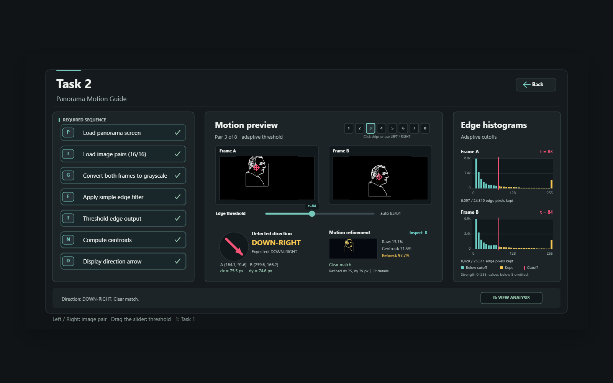

# Vision Studio

An interactive image-processing application built with JavaScript and p5.js. It combines portrait background removal with a step-by-step demonstration of motion estimation between image pairs.

Developed as the Graphics Programming final project for the University of London BSc Computer Science programme.

## Features

### Cutout Carousel

- Processes eight portraits using per-image RGB or HSB background thresholds.
- Compares both colour-space trials alongside each original portrait.
- Provides dark, light and checkerboard backgrounds for inspecting cutout boundaries.
- Animates the selected cutouts in a streaming carousel.

### Motion Guide

- Demonstrates grayscale conversion, Sobel edge detection, thresholding and centroid calculation.
- Estimates displacement between two frames and classifies its direction.
- Includes eight image pairs covering horizontal, vertical and diagonal motion.
- Offers adaptive thresholds, manual adjustment and edge-distribution histograms.
- Compares centroid alignment with a local refinement search, including an overlap overlay, a search heatmap and reliability indicators.

## Run locally

Serve the project directory over HTTP using any static web server. With Python 3 installed:

```sh
python -m http.server 8000 --bind 127.0.0.1
```

Open [http://localhost:8000](http://localhost:8000) in a desktop browser. Windows users with the Python launcher can substitute `py` for `python`. No package installation or build is required; p5.js 1.9.4 and all 24 demonstration images are included.

## Explore the application

Press `1` for Cutout Carousel or `2` for Motion Guide; the home-screen cards are also clickable. Use the on-screen Back button to leave a detailed view.

**Cutout Carousel**

1. Press `C` to prepare the screen, then `L` to load and process the portraits.
2. Press `S` to start the animation.
3. Press `V` to compare RGB and HSB results. While comparing, use Left / Right to change portrait, `B` to change the inspection background, and `V` or Escape to close the comparison.

**Motion Guide**

1. Press `P` to prepare the screen, then `I` to load the image pairs.
2. Press `G`, `E`, `T`, `N`, then `D` to create grayscale frames, edges, threshold masks, centroids and the motion result in order.
3. Use Left / Right or the pair selectors to choose another pair. Follow the displayed processing steps after changing a pair.
4. Adjust the threshold slider or use the analysis controls to inspect the effect on the result.
5. After calculating direction, press `R` to open the refinement evidence. Press `R` or Escape to close it.

## Project structure

- `sketch.js`: shared application controller, navigation and drawing helpers.
- `task1.js`: portrait masks, comparison views and carousel animation.
- `task2.js`: edge processing, thresholds, motion estimates and refinement views.
- `assets/task1/people/`: eight portrait images.
- `assets/task2/provided/`: four supplied image pairs.
- `assets/task2/generated/`: four additional repositioned image pairs.
- `libraries/p5.min.js`: bundled p5.js distribution.

## Scope and limitations

The portraits use tuned thresholds for the included images; this is not a general-purpose background-removal service. Motion estimation assumes primarily translational movement. Rotation, scaling, complex backgrounds and weak or ambiguous edges can reduce reliability. Overlap scores indicate alignment quality, not a probability that a motion estimate is correct. The wide analysis view is intended for desktop screens.

The portfolio copy passed syntax, local asset-reference checks and a browser smoke test in headless Microsoft Edge. All eight portraits loaded and produced RGB/HSB comparisons; carousel startup and comparison navigation were checked. All eight image pairs completed the keyboard-driven grayscale, edge, threshold, centroid and direction sequence, matching their expected directions. The refinement detail view was also opened and closed. Manual threshold adjustment and cross-browser behaviour have not been exhaustively tested.

## Credits

Created by Faizan Ilyas using [p5.js](https://p5js.org/). The bundled p5.js license is retained in `libraries/p5-LICENSE.txt`. The source identifies some images as supplied coursework assets; the collection does not establish their original license or redistribution terms. No blanket license is assigned to the project or image assets.

## Preview


